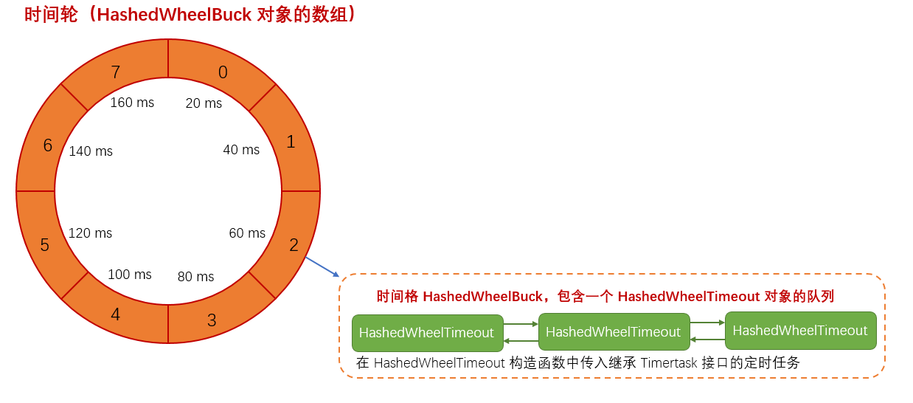

## HashedWheelTimer
　　简化版时间轮，参考了 Netty 的 HashedWheelTimer，原版是放到一个类。这里放到多个类，便于直观了解。 
　　没有使用位运算来获取索引，而是用 %，去除参数校验，下图为时间轮构造。

- **HashedWheelTimer，时间轮。** 为 HashedWheelBucket[]，即包含多个 HashedWheelBucket；
	1. Worker，时间轮中的线程，核心逻辑，
	2. timeouts，待添加到时间轮中的定时任务队列。通过调用 newTimeout() 方法，将新的定时任务包装成 HashedWheelTimeout 添加到 timeouts 中；
	3. tasks，一次从 timeouts 中读取 tasks 个定时任务到时间轮中；
- **HashedWheelBucket，时间格。** 包含一个 HashedWheelTimeout 的队列，Worker 线程会遍历时间格 HashedWheelBucket，从待执行的任务队列 timeouts 中取 tasks 个任务添加到时间格中；
- **TimerTask，为单个定时任务的接口。** 新任务需要继承该接口重写 run 方法；
- **HashedWheelTimeout，单个定时任务。** 包含该任务的截止时间、剩余轮数；
    1. 通过构造函数传入任务 TimerTask；
    2. 通过 expire() 方法调用 TimerTask#run() 方法，来执行该定时任务。而 HashedWheelTimeout 是在时间格中的一个队列中；

### 添加定时任务
　　通过 HashedWheelTimer#newTimeout 添加定时任务，任务需要继承 TimerTask 接口，重写 run 方法。 
　　将任务包装成 HashedWheelTimeout，添加到队列 timeouts 中。后面轮询时间格时，会从该队列 timeouts 获取定时任务，添加到时间格中。

### 执行流程
　　启动 Worker 线程，执行 run() 方法。

- 遍历时间格，假设当前时间格 tick 为 2；
- transferTimeoutsToBuckets()，从待执行的任务队列 timeouts 中获取定时任务，计算该定时任务所属时间格（假设为 5）及剩余轮数，将定时任务添加到该时间格 5；
- expireTimeouts()，遍历当前时间格 2 的 HashedWheelTimeout 队列，如果已到期，且剩余轮数小于等于 0，则执行该定时任务。
- tick 加一，继续遍历下个时间格中的任务。

#### 线程取消流程

- 遍历每个时间格 HashedWheelBucket，将未执行的任务添加到集合 unprocessedTimeouts 中；
- 将待执行的定时任务队列 timeouts 中未执行的任务添加到集合 unprocessedTimeouts 中。

