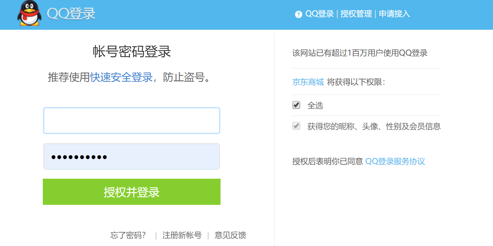
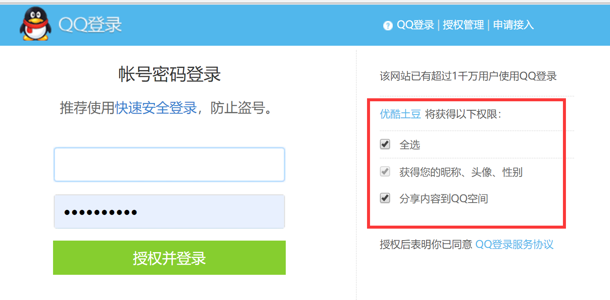

### OAuth2 的名词概念
　　以京东网站，用 QQ 登录为例，讲解 OAuth2 的名词概念。

- **Third-party application，第三方应用程序。** 又称为客户端，这里为京东网站；
- **HTTP service，HTTP 服务提供商。** 这里为 QQ；
- **Resource Owner，资源所有者。** 因为拥有个人 QQ 信息的资源（使用 QQ 信息作为京东账号登录），又称为用户；
- **User Agent，用户代理。** 这里为浏览器；
- **Authorization server，认证服务器。** HTTP 服务提供商用来处理认证的服务器，这里指 QQ 的认证服务器，负责发放授权码和令牌；
- **Resource server，资源服务器。** HTTP 服务提供商存放用户资源的服务器，这里指 QQ 的资源服务器，根据令牌的权限获取不同的资源。一般令牌的权限为只读权限，可分多种，比如读取 QQ 的个人信息、QQ 的联系人信息等。

### 流程解析
　　用户打开京东网页（第三方应用程序），用户想用 QQ 登录京东，但不想告诉京东网站 QQ 账号、密码，所以使用授权码形式进行登录。

　　如上图，点击使用 QQ 登录，京东会跳转到 QQ 的认证服务器上。跳转到 QQ 认证服务器的网址，为 "https://graph.qq.com/oauth2.0/show?which=Login&display=pc&response_type=code&state=abcde&client_id=100273020&redirect_uri=https%3A%2F%2Fqq.jd.com%2Fnew%2Fqq%2Fcallback.action%3Fview%3Dnull%26uuid%3De30bbcf4f9634680b8a30c19929f902c"，由几部分组成。

- "response_type=code"，必传参数。因为使用授权码登录，所以返回结果为授权码；
- "state=abcde"，可传参数。表示京东（第三方应用程序）的当前状态；
- "client_id=100273020"，必传参数。这是京东在 QQ 认证服务器上配置的 Client 编号，如果是优酷使用 QQ 登录，优酷在 QQ 认证服务器上配置的 client_id=200004。每个接入 QQ 认证服务器的网站，都有一个对应的 client_id；
- "scope"，可选参数。表示申请授权的令牌，不同令牌对应不同的权限；
    1. 这里京东没有传入令牌，看上图，京东申请 QQ 的权限是默认的；
    2. 以优酷使用 QQ 登录为例，如下图，有个可选权限。认证网址的 "scope=get_user_info,list_album,upload_pic, ..."，令牌有多个，使用逗号分隔，get_user_info 表示获取用户信息的令牌；
- "redirect_uri=https%3A%2F%2Fqq.jd.com%2Fnew%2Fqq%2Fcallback.action%3Fview%3Dnull%26uuid%3Dcc50e8e814b74fcbb333e1d77e67ad83"，可选参数，回调网址。

　　当用户确认授权后，以京东为例，在 QQ 认证授权页面，输入 QQ 的账号、密码，即确认授权。然后 QQ 的认证服务器会发放授权码，比如 response_type=12345。 
　　前面提到京东跳转到 QQ 认证服务器的网址包含 response_type=code 和重定向网址 redirect_uri，认证服务器会跳转到该指定的重定向网址，加上授权码，如下。

>https%3A%2F%2Fqq.jd.com%2Fnew%2Fqq%2Fcallback.action%3Fview%3Dnull%26uuid%3Dcc50e8e814b74fcbb333e1d77e67ad83/callback?code=12345

　　京东收到授权码后，将授权码 response_type、重定向 URI、client_id 和 client_id 对应的密码，再次向 QQ 的认证服务器申请令牌。QQ 认证服务器核对 response_type、redirect_uri、client_id 和 client_id 对应的密码，根据授权码来发放访问令牌（access token）和更新令牌（refresh token）。授权码的授权程度不同，令牌的权限也不同。<r />
　　京东拿到令牌后，会向 QQ 的资源服务器申请获取资源。比如用户授权的是获取 QQ 的个人信息，于是京东的令牌 access token，就可以从 QQ 的资源服务器获取到 QQ 的个人信息。至此，京东获取到 QQ 的个人信息，依据此创建一个京东账号进行登录。

### 总结

- 用户登录京东，使用 QQ 登录，跳转到 QQ 认证服务器的授权页面；
- 用户同意授权后，QQ 认证服务器会发放授权码给京东；
- 京东根据授权码，再次请求 QQ 认证服务器，获取访问令牌（access token）；
- 京东拿到 QQ 认证服务器发放的访问令牌后，使用令牌，向 QQ 的资源服务器申请用户的资源（个人信息）；
- QQ 资源服务器根据令牌的权限，将用户的 QQ 个人信息，传给京东；
- 京东获取到 QQ 的个人信息后，依此创建一个京东账号，这样就能用 QQ 登录到京东。

### reference 

- [理解 OAuth 2.0](http://www.ruanyifeng.com/blog/2014/05/oauth_2_0.html)
- [OAuth 2.0 的一个简单解释](http://www.ruanyifeng.com/blog/2019/04/oauth_design.html)
- [OAuth 2.0 的四种方式](http://www.ruanyifeng.com/blog/2019/04/oauth-grant-types.html)
- [芋道 Spring Security OAuth2 入门](http://www.iocoder.cn/Spring-Security/OAuth2-learning/?self)