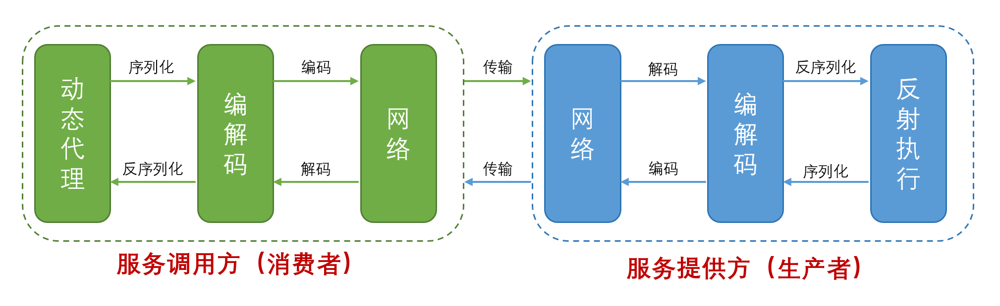
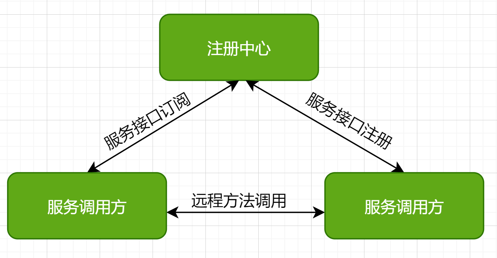
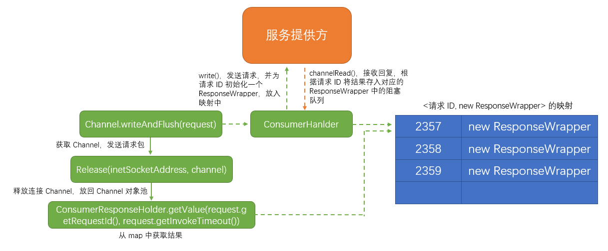

### RPC 框架结构

- **common，** 包含要调用的接口、实体类、工具类；
- **consumer，** 消费者，包含动态代理、反射调用、Netty Channel 对象池、注册消费者信息到 ZooKeeper；
- **handler，** Netty 的编解码 handler、消费者的 handler、生产者的 handler；
- **load-balance，** 负载均衡，选择一个消费者发起 RPC 调用；
- **provider，** 实现要调用接口的方法，将接口信息注册到 ZooKeeper；
- **serialization，** 序列化方法，RPC 调用是网络传输，所以需要进行序列化变为二进制数据；
- **zookeeper，** 为生产者的和消费者的接口信息创建节点路径，提供生产者接口列表到本地缓存；

### RPC 调用流程



### 动态代理
　　在 common 模块中包含服务提供方的接口，通过注解 @RpcInterface 自动为该接口生成一个代理类。<br />
　　Spring AOP 提供统一拦截，**在接口方法被调用时拦截，由创建的代理对象，调用反射方法，在反射方法中封装一套远程调用逻辑。**

- 在 ConsumerBootStrap#afterPropertiesSet() 方法中，会扫描标注了 @RpcInterface 的类，为其创建代理对象，并注册到 Spring 容器中；
```java
    // ... 
    Set<Class<?>> typesAnnotatedWith = reflections.getTypesAnnotatedWith(RpcInterface.class);
    for (Class<?> clazz : typesAnnotatedWith) {
        // 调用反射，为标注了 @RpcInterface 的接口创建代理对象
        ConsumerProxy consumerProxy = ConsumerProxy.generate(clazz, timeout, loadBalanceStrategy);
        // 将代理对象注册到 Spring 容器中
        beanFactory.registerSingleton(clazz.getSimpleName(), consumerProxy.getProxy(clazz));
```

- 消费者启动类 ClientApplication，是 从 Spring 上下文中获取该接口的代理对象 bean，而不是该接口；
```java
HelloService helloService = (HelloService) context.getBean("HelloService");
```

- 调用代理对象的 ConsumerProxy#invoke() 方法，该方法会发起远程 RPC 调用。
    1. 使用 JDK 默认的 InvocationHandler 能完成代理功能，即 ConsumerProxy 继承了 InvocationHandler 接口，实现 invoke() 方法；
    2. InvocationHandler 接口的生成代理类，已在扫描标注了 @RpcInterface 的类时创建，并注册到 Spring 容器中。

```java
    for (int i = 0; i < 1000; i++) {
        // 使用动态代理，代理对象，调用反射方法
        System.out.println(helloService.sayHello("martin, " + i));
        Thread.sleep(2000);
    }
```

### 服务发现
　　使用 ZooKeeper 来实现服务发现机制，**本质是一个接口和服务提供者的 IP 地址列表的映射，通过子节点命名来实现。** <br />
　　ZooKeeper 注册节点格式为 "根路径" + "接口全名" + "类型（生产者 / 消费者）" + "IP 地址|端口"，比如 root/com.martin.helloService/consumer/localhost|8081 。

- **IRegisterCenterForConsumer 接口，负责服务订阅。** 从注册中心查找并订阅要调用接口的 IP 地址列表；
- **IRegisterCenterForProvider 接口，负责服务注册。** 将要提供的接口注册到注册中心上，注册中心使用节点路径保存该接口和其 IP 地址。



　　生产者和消费者注册的节点是为临时节点，通过命名来保存 IP 和端口的信息。服务订阅时，会从注册中心拉取一份要调用接口的 IP 地址列表到本地缓存中，服务调用方是直接发起远程调用到服务提供方，如上图。<br />
　　在注册时还会注册监听器，当节点有变化时，ZooKeeper 会通知订阅该节点的服务调用方（消费者），会在该接口的本地缓存中，删除有变化的节点信息，即不调用该 IP。

### 负载均衡
　　在服务发现模块讲到，服务消费者会从注册中心（ZooKeeper）上根据接口名拉取一份该接口与 IP 地址列表的映射到本地缓存，**而负载均衡是在本地缓存列表中实现的。** <br />
　　默认接口为 ILoadBalance，**按照模板方法设计模式，实现该接口的默认抽象类为 AbstractLoadBalance，封装负载均衡的流程。** 继承该类，提供了两种负载均衡策略，轮询 PollingBalance 和随机 RandomBalance。

#### 对比 dubbo 的设计
　　**dubbo 在负载均衡的设计中加入一个预热期，** 即当前时间 - 启动时间。因为机器刚启动 JVM 时，不是一下子就进入状态的，需要有个适应期，所以在刚启动时只需承接小部分流量，当预热期过后，才承接 100% 的流量，通过一个预热期和权重来控制。<br />
　　假设预热期为 10min，权重为 100。如果机器已启动 1 分钟，计算得到权重为 10。有 3 台机器 A、B、C，权重分别为 10、20、100。使用随机算法，是在权重总和 10+20+100=130 中获取一个随机数。假设为 23，落在机器 B 的范围（10 ~ 30)，所以选择机器 B。

#### 启动预热
　　启动一段时间后，机器运行程序速度会变快。因为虚拟机 JVM 会把常执行的代码编译成机器码，将加载过的类放到 JVM 缓存中，提高执行速度。而初始时，需要进行编译和放到缓存中，所以会比较慢。<br />
　　前面提到不让启动期承接大流量，而是随着启动时长来增加承接的流量，可将启动时间放到注册中心，比如 ZooKeeper 上的临时节点中。
  
- 服务提供方启动时，将接口信息和启动时间注册到注册中心中；
- 服务调用方获取该接口对应的服务提供方 IP 列表时，同时获取它们的启动时间；
- 在负载均衡上，分配时多加一个维度启动时间，可看 dubbo 的设计。

### 协议设计
　　在 NettyCodecHandler 中简单设计一个定长协议，由协议头（固定 4 字节，存储内容长度） + 协议体（字节内容）组成。**通过读取内容长度来切割请求包，防止粘包和半包问题。** 协议体包含一个 Request 对象，该对象包含请求消息 ID 属性。<br />
　　这里是简化设计，一个标准协议头，包括魔数、长度、消息 ID、协议版本、消息类型、序列化方式等。

### 异步设计
　　重点在于发送请求时，**需要将请求 ID 存入本地缓存 Map 中。后面接收回复时，根据回复 ID 放入对应的结果。** 获取时，使用阻塞队列中带有超时的方法来获取结果，达到异步效果。



#### NettyCodecHandler#write
　　客户端发送请求时，会为该请求 ID 创建一个 ResponseWrapper 对象，放入一个 map 中。后续获取回复结果时，根据请求 ID 来获取 ResponseWrapper 对象，从 ResponseWrapper 中获取值。

```java
    @Override
    public void write(ChannelHandlerContext ctx, Object msg, ChannelPromise promise) throws Exception {
        if (msg instanceof Request) {
            Request request = (Request) msg;
            // 发送请求数据时，先将该 requestId 放入 map 中
            ResponseHolder.initResponse(request.getRequestId());
        }
        // 传到下个 handler
        super.write(ctx, msg, promise);
    }
    
    private static final Map<String, ResponseWrapper> futureMap = new ConcurrentHashMap<>();

    /**
     * ResponseHolder#initResponse
     **/
    public static void initResponse(String requestId) {
        // 初始化一个 ResponseWrapper 对象，放入 map 中
        futureMap.put(requestId, new ResponseWrapper());
    }
```

#### NettyCodecHandler#channelRead
　　服务端解析请求后，计算结果并发送回复。NettyCodecHandler#channelRead 方法会接收到回复结果，将其放入 map 中。

```java
    @Override
    public void channelRead(ChannelHandlerContext ctx, Object msg) throws Exception {
        if (msg instanceof Response) {
            Response response = (Response) msg;
            // 读取回复时，将结果存入 future 中
            ResponseHolder.putResponse(response);
        }
        // 传到下个 handler
        super.channelRead(ctx, msg);
    }
    
    /**
     * ResponseHolder#putResponse
     **/
    public static void putResponse(Response response) {
        // 获取数据时，将结果存入 future 中
        ResponseWrapper responseWrapper = futureMap.get(response.getResponseId());
        responseWrapper.setResponseTime(System.currentTimeMillis());
        // 将回复存入阻塞队列中
        responseWrapper.getResponseBlockingQueue().add(response);
        futureMap.put(response.getResponseId(), responseWrapper);
    }
```

#### ResponseHolder#getResponseValue
　　根据请求 ID 从 map 中获取 ResponseWrapper 对象，该对象包含一个容量为 1 的阻塞队列，用于存放回复结果。<br />
　　使用阻塞队列带超时的 poll() 方法，来获取结果。

```java
    /**
     * ConsumerCallable#call
     **/
    ResponseHolder.getResponseValue(request.getRequestId(), request.getInvokeTimeout())

    public static Response getResponseValue(String requestId, long timeout) {
        ResponseWrapper responseWrapper = futureMap.get(requestId);
        try {
            return responseWrapper.getResponseBlockingQueue().poll(timeout, TimeUnit.MILLISECONDS);
        } catch (Exception e) {
            logger.error("获取结果失败: " +  e);
        } finally {
            // 超时或未完成则移除
            futureMap.remove(requestId);
        }
        return null;
    }
```


