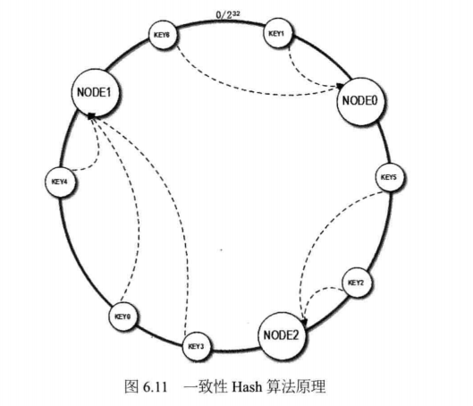
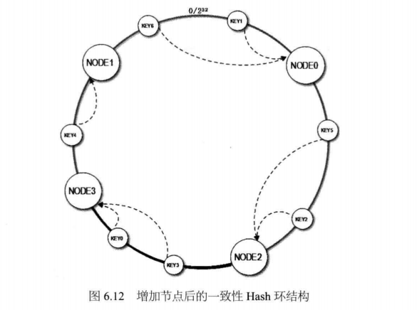
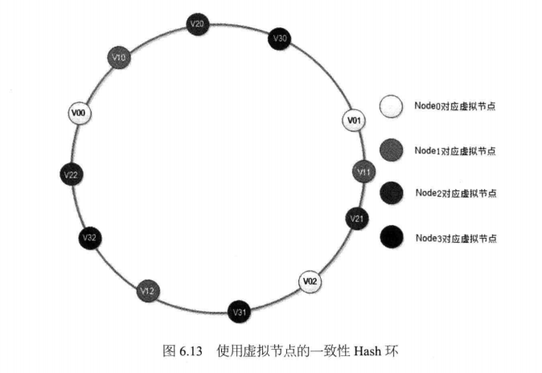

## 一致性 Hash 算法
  
　　在分布式系统中，比如分布式缓存或分布式数据库，会有路由算法，决定请求该访问哪台服务器，有如下几种：
  
- 取余 Hash；
- 一致性 Hash 算法；
- 使用虚拟节点的一致性 Hash 算法。

### 取余 Hash
　　取余 Hash 是最简单的路由算法，只要引用程序的 key 相同，则会访问同一台服务器。以分布式缓存 redis 为例，假设有三台服务器，每台服务器缓存一部分图片资源。具体流程：
  
- 应用程序请求一张图片 key，对图片 key 进行 Hash 得到哈希值，比如为 25；
- 将哈希值除以服务器数目，即 25 % 3 = 1，余数为 1，对应的为编号 1 的服务器；
- 访问编号为 1 的服务器，根据 key 获取缓存图片资源。

#### 缺点

　　数据库的取余 Hash 也是同理，但存在一个严重问题。如果需要进行扩容，从 3 台服务器扩容到 5 台，则会导致取余 Hash 的结果错误。25 % 5 = 0，会访问编号为 0 的服务器。
  
- 如果是数据库，则需要将数据进行重新哈希，分布；
- 如果是缓存服务器，则通过模拟请求的方法来逐渐预热缓存，使缓存服务器中的数据重新分布。通常在半夜（访问量低时）进行，防止出现缓存穿透，导致数据库挂了的问题。

### 一致性 Hash 算法
　　通过一致性 Hash 环的数据结构来实现 key 到缓存服务器的 Hash 映射。具体流程，还是以缓存服务器为例：
  
  

- 构造一个长度为 $2^{32}$ 的整数环（称为一致性 Hash 环）；
- 根据节点名称的 Hash 值（其分布范围为 [0,  $2^{32}$ - 1]），将缓存服务器节点放置在这个 Hash 环上。比如第一台服务的 Hash 值为 12，放置在 Hash 环上，第二台服务器的 Hash 值为 $2^{17}$，第三台服务器的 Hash 值为 $2^{30}$ 等；
- 再计算请求缓存 Key 的 Hash 值，比如为 9897，其分布范围同样为 [0,  $2^{32}$ - 1]；
- 在 Hash 环上顺时针查找举例这个 Key 的 Hash 值最近的缓存服务器节点，即第二台服务器。可理解为第二台服务器的范围为 [13, $2^{17}$ - 1]，因为 9897 在第二台服务器范围；
- 最后将请求发往第二台服务器；

#### 节点扩容
　　当对缓存服务器群进行扩容时，同样是将缓存服务器节点放置在这个 Hash 上。新节点的 Hash 值为 $2^{9}$，如果请求缓存 Key 的 Hash 值为 9897，按照顺时针，这次会访问新节点，因为 9897 在新节点的 Hash 值的范围内（[13, $2^{9}$ - 1]）。 
　　以下图为例，上图的 key3 和 key0 是访问节点 1 的，这次新增了节点 3，按照顺时针方向，key3 和 key0 先访问节点 3。而其它是不变的，保证大部分缓存数据都会命中，只有 key3 和 key0 不会被缓存命中，因为新增节点 3 没有该缓存。 
　　相比取余 Hash 算法，从 3 台服务器增加到 4 台时，会导致约有 75%（3 / 4） 的数据不能被缓存命中，一致性 Hash 算法是 75% 的命中。如果初始集群规模很大，比如 100 台，这时新增一台，命中则为 99%。
  
  

#### Hash 环的实现
　　一致性 Hash 环通常使用二叉查找树实现，Hash 查找过程实际上是在二叉查找树中查找不小于该值的最小数组。这个二叉树最右边的叶子节点和最左边的叶子节点相连接，构成环。
  
#### 缺点
　　新加的节点，导致路由算法的不均衡，即负载不均衡。以上图为例，与之前相比节点 1 的请求有 50% 分担给了节点 3，但节点 2 和节点 0 不变，所以其请求数是节点 1和节点 3 的两倍。

### 使用虚拟节点的一致性 Hash 算法
　　通过增加一层虚拟层来改进一致性 Hash 算法的负载不均衡问题，以下图为例：
  
- 将每台物理上的缓存服务器虚拟为一组虚拟的缓存服务器，比如编号为 0 的缓存服务器虚拟为三个虚拟缓存服务器，分别为 V00、V01、V02，编号为 1 的为 V11、V12、V13；
- 然后对虚拟服务器进行 Hash，获得 Hash 值放在 Hash 环上；
- 访问 V01、V02、V03 的虚拟服务器，都是访问编号为 1 的实体服务器；
- 这时新增实体服务器，编号为 3，对应的虚拟服务器节点为 V31、V32、V33，同样是对其 Hash，获得 Hash 值放置在 Hash 环上；

　　与物理节点的一致性 Hash 算法对比，虚拟节点的会有多个，来分担各节点的请求，而物理节点的只能分担一个节点的请求资源。如每个物理节点的虚拟节点越多，则各个物理节点之间的负载越均衡。一般一个物理节点对应 150 个虚拟节点，当然还是根据实际业务和场景来调整。

  

### reference

- [大型网站技术架构-核心原理与案例分析](https://item.jd.com/11322972.html?dist=jd);
